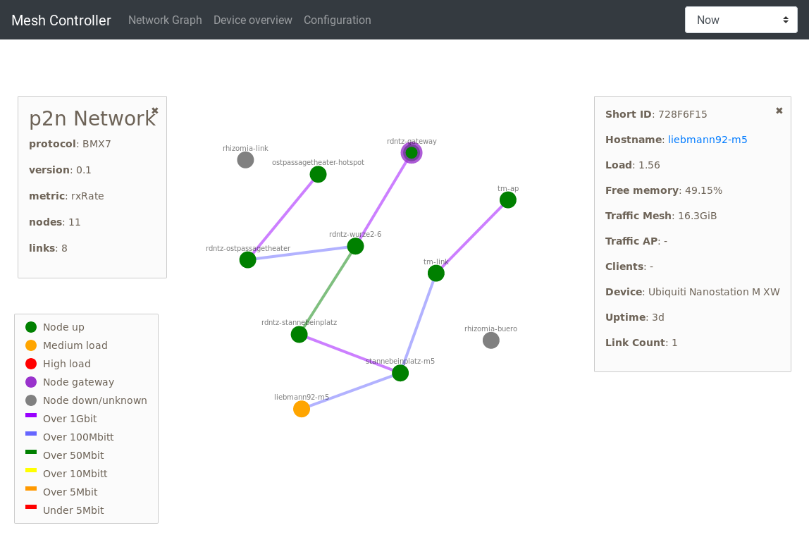
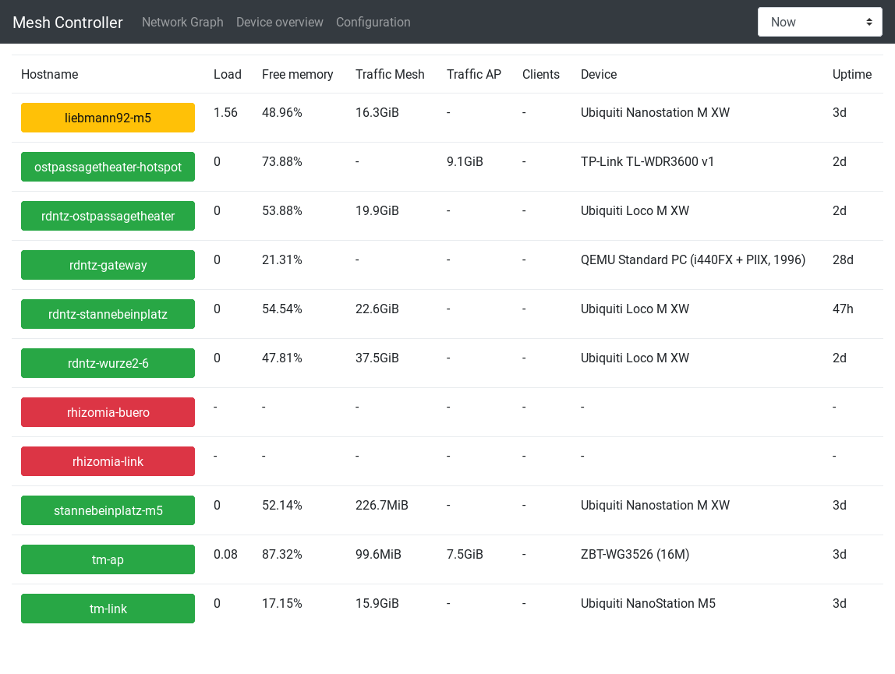

# meshrc

Tool set to simplify monitoring and managing of a mesh network. All software
was created within my bachelor thesis. Feel free to comment & grumble.

Scope during development was the distribution of internet uplink for festivals
or events. However parts could be useful for community networks as well.

The development will not stop at this point, I'll continue to expand the tools
functionality and hopefully make it more generic.

## meshrc-web

Uses the
[prometheus-node-exporter-lua](https://github.com/openwrt/packages/tree/master/utils/prometheus-node-exporter-lua)
with BMX7 plugin to generate valid [NetJson](http://netjson.org/) which can be
visualized via [netjsongraph.js](https://github.com/netjson/netjsongraph.js)



Also creates an simple overview & allow configuration of the mesh via `meshrc-client`.




## meshrc-cli

Has various command to set the mesh configuration:

```
Usage: ./cli.sh
    -h --help                           : show this message
    -i --shortid <shortid>              : short id of node to be configured
    -l --list-nodes                     : show all nodes of mesh network
    -n --node-name <name>               : sets node name for given shortId
    -a --ap-pass <passworkd>            : set access point password of all nodes
    -m --mesh-pass <passworkd>          : set mesh password of all nodes
    -f --firstboot                      : resets all nodes by removing overlayfs
    -r --raw                            : runs given command directly on node
    -s --set-ssh <ssh_keys>             : set ssh key to all nodes
Examples:
    ./cli.sh -i ABCD1234 -a "individual-ap-password"
    ./cli.sh -i ABCD1234 -r "reboot"
    ./cli.sh -m "new-mesh-password"
```

The command transport is done via `bmx7-sms` and requires clients that trust the
sending node.

## meshrc-client

Runs a daemon which waits for received commands and runs them if the sender is
trusted.

## meshrc-initial

Daemon that tries to download an initial configuration from all directly
connected devices via `link-local`. If an archive is successfully received it
will unpack it to the device root `/` and reboots.

This is especially useful with `uci-defaults` and is used by [meshrc-web] which
automatically generates an archive containing all settings from the
configuration view. On change, a new archive is packed and locally delivered.
Unconfigured nodes can be connected to the device running [meshrc-web] and
automatically receive passwords to connect to the encrypted mesh.
